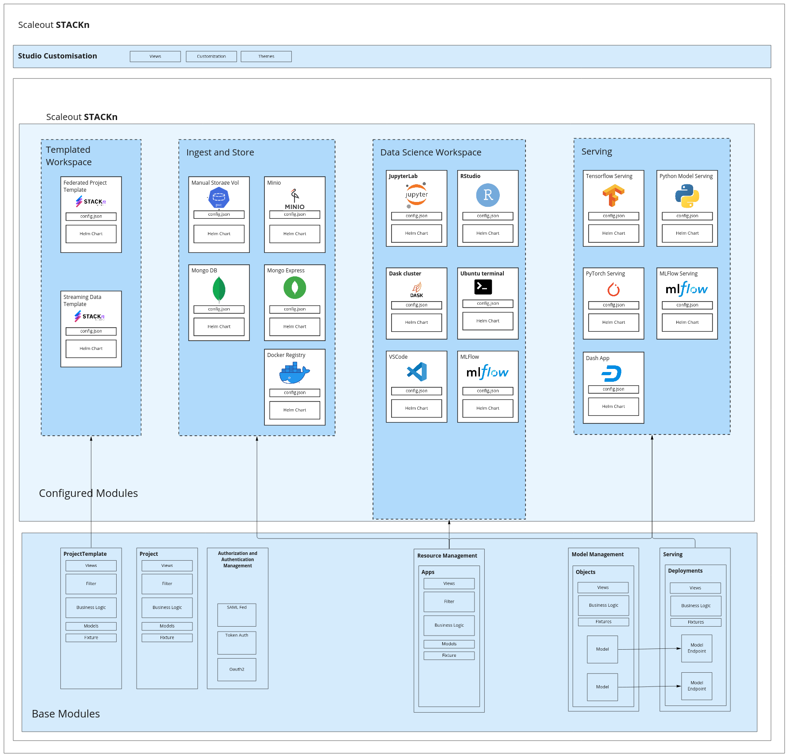
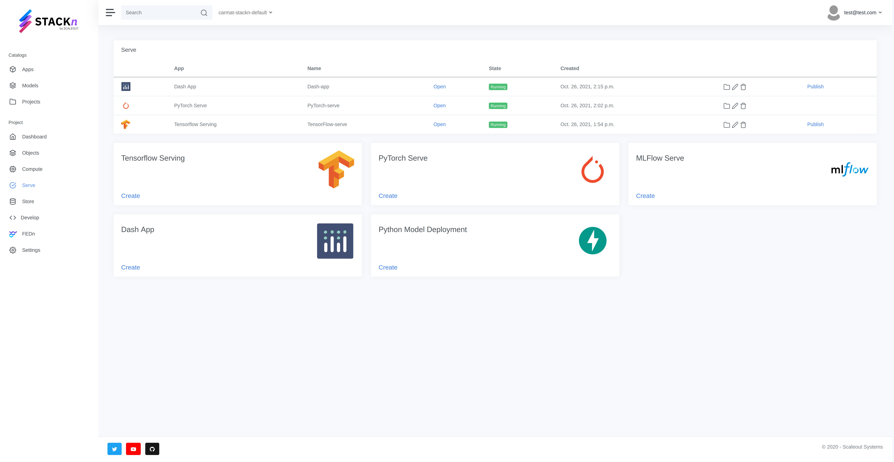

[](https://github.com/scaleoutsystems/stackn/actions/workflows/integration-tests.yaml)
[](https://github.com/scaleoutsystems/stackn/actions/workflows/cli-code-checks.yaml.yaml)
[](https://github.com/scaleoutsystems/stackn/actions/workflows/studio-code-checks.yaml.yaml)
[](https://scaleoutsystems.github.io/stackn/#/)

Community<br>
[](https://discord.gg/KMg4VwszAd)

* [What is STACKn?](#what-is-stackn)
* [Setup a local deployment](#setup-a-local-deployment)
* [Where is STACKn used?](#where-is-stackn-used)
* [Maintainers](#maintainers)

# What is STACKn?

STACKn is a lightweight, cloud-native machine learning platform that lets data scientist collaborate on ML projects where they can share datasets, work in Notebook environments, track experiments and serve ML models. STACKn also lets you deploy models and apps in public or private catalouges for sharing model endpoints and custom dashboards.   

<figure>
  <p align="center">
    
  </p>
  <figcaption align = "center"><b>Overview of the components and workspaces of STACKn. Observe that STACKn has a plug-in atchitecture for applications and not all apps in this figure are included in this repository.</b></figcaption>
</figure>

<br />
<br />

<figure>
  <p align="center">
    
  </p>
  <figcaption align = "center"><b>Overview of STACKn Serve UI. The user deploys models choosing from popular open source model serving software, exposed as easily configurable applications. The same functionality is also available from the CLI. </b></figcaption>
</figure>
<br />
<br />


STACKn is a Django framework implementing project-based multi-tenancy, autentication, authorization and object-level permissions on top of popular open source data science tools. An intuitive UI lets users create private or shared projects in which various assets are deployed: 

- Storage: manage private and shared storage volumes and object storage. Control access on a project and user level. 
- Notebooks: Jupyter notebooks, RStudio 
- Experiment tracking: MLFlow 
- Model registry and serving: STACKn Models, MLFlow, Tensorflow Serving, PyTorch Serve and MLFlow Serve. 
- Environments: Configure custom Docker environments backing the applications.  
- Dashboards / Apps: Easily deploy and host Dash, Flask and RShiny UIs and apps.     

STACKn is highly customizable and cloud agnostic. Deployments can be configured on any infrastructure that implements the Kubernetes API, and is packaged using Helm charts.

<br />
<br />

# Setup kubernetes cluster (single node)
This deployment is for quick testing on Debian/Ubuntu and will not require any TLS certificates.
Below are instructions to install a local kubernetes cluster (single node) via Microk8s, however, you can use any kubernetes manager. 
<br />

## Setup single-node microk8s

1. Install microk8s

```bash
sudo snap install microk8s --classic
```
2. Add user to microk8s group and give permissions to the k8s config folder

```
sudo usermod -a -G microk8s $USER
sudo chown -f -R $USER ~/.kube
newgrp microk8s
```
3. Enable extensions
```
microk8s.enable dns rbac ingress storage
```
4. If kubectl is installed on host add cluster config to kubectl config
```
microk8s config >> ~/.kube/config
```
5. Finally, install the latest version of Helm since microk8s is usually not packaged with the latest Helm version.
**Follow the instructions** [here](https://helm.sh/docs/intro/install/#from-apt-debianubuntu)

## (Quick start) Deploy STACKn via Helm

Change `global.postgresql.storageClass` for your particular cluster.

```bash
$ helm repo add scaleout https://scaleoutsystems.github.io/charts/scaleout/stackn
```
Get kubernetes config, e.g:
```bash
$ cluster_config=$(cat ~/.kube/config | base64 | tr -d '\n')
```
Deploy the chart
```bash
$ helm install --set kubeconfig=$cluster_config --set global.postgresql.storageClass=microk8s-hostpath \
  stackn scaleout/stackn
```
Once all services are up and running, navigate to http://studio.127.0.0.1.nip.io in your browser.


## Deploy STACKn for local development with Docker Compose
Observe that you still need a kubernetes cluster to deploy resources within STACKn. However, for local development of the Django project, we recommend deploying with docker compose.

1. Clone this repository locally:
```
$ git clone https://github.com/scaleoutsystems/stackn.git
```

2. Navigate to the directory “components/studio“:
```
$ cd stackn/components/studio
```
At this directory there are two files that need to be modified before running the command `docker-compose up`:
- `cluster.conf`
  - update this file with your kubernetes cluster config by running: `$ microk8s config > ./cluster.conf`
- `studio/settings.py`
  - The settings file for the Django project. Update this file by searching and replacing **all** occurrences of `<your-domain>` with your local IP or localhost domain. Obs that certain features will not work if using localhost since stackn apps depends on an external ingress controller. Therefore, it can be useful to use a wildcard dns such as [nip.io](http://nip.io). For example, if your local IP is 192.168.1.10 then the `<your-domain>` field becomes `192.168.1.10.nip.io`.


**Note:** We have created a quite basic shell utility script that takes care of the above manual changes. You can find it under the same directory (i.e. `stackn/components/studio`) and it is called [`init.sh`](components/studio/init.sh). Follow the instruction in the prompt.

```bash
./init.sh
```

3. Finally, fire up STACKn with the following simple command:
```
$ docker-compose up
```
**Note:** in the `docker-compose.yaml` file, it is important to know and be aware that there exists flag for the studio container which default value is:
- `INIT=true`

This flag is used by the studio container when starting the web server with the script [`run_web.sh`](components/studio/scripts/run_web.sh).

The `INIT` flag tells the studio container whether the initial database migrations, fixtures and admin user should be created. This means that such flag should be set to `true` whenever a fresh instance/deployment of STACKn is needed.


## Start using STACKn
Open studio in your browser (for example `studio.192.168.1.10.nip.io:8080`), register a new user with the "Sign up" button and create a new project. Here are [tutorials](https://scaleoutsystems.github.io/stackn/#/tutorial) to get you started! Happy STACKning!
<br />
<br />
# Production deployment
Please contact info@scaleoutsystems.com or reach out to the maintainers! 
# Where is STACKn used?
STACKn is used in various places, an example include [SciLifeLab Data Center](https://www.scilifelab.se/data). For a live view of their deployment visit [Scilifelab Serve](https://serve.scilifelab.se/).
<br />
<br />
# Maintainers
**Scaleout Systems AB** is the main contributing organization behind this project.
- Morgan Ekmefjord
- Fredrik Wrede

## Software provided "as is"
THE SOFTWARE IS PROVIDED "AS IS", WITHOUT WARRANTY OF ANY KIND, EXPRESS OR IMPLIED, INCLUDING BUT NOT LIMITED TO THE WARRANTIES OF MERCHANTABILITY, FITNESS FOR A PARTICULAR PURPOSE AND NONINFRINGEMENT. IN NO EVENT SHALL THE AUTHORS OR COPYRIGHT HOLDERS BE LIABLE FOR ANY CLAIM, DAMAGES OR OTHER LIABILITY, WHETHER IN AN ACTION OF CONTRACT, TORT OR OTHERWISE, ARISING FROM, OUT OF OR IN CONNECTION WITH THE SOFTWARE OR THE USE OR OTHER DEALINGS IN THE SOFTWARE.

## License
> See [LICENSE](LICENSE) for details.
