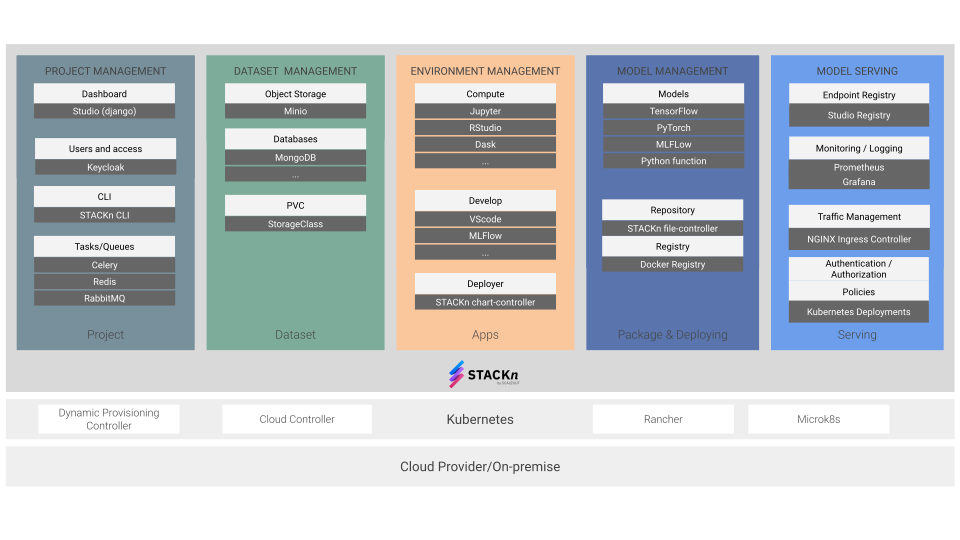

* [What is STACKn?](#what-is-stackn)
* [Setup a local deployment](#setup-a-local-deployment)
* [Where is STACKn used?](#where-is-stackn-used)
* [Maintainers](#maintainers)

# What is STACKn?

STACKn is a machine learning platform that lets data scientist collaborate on projects where they can share datasets, work in various development environments, and deploy and serve trained models and analytics apps without worrying about DevOps.

<p align="center">
  
</p>
<p align="center">
  
</p>


With an intuitive web UI, users can create private or shared projects in which various data science applications can be deployed, such as
- Dataset: project storage volumes, object stores, and databases for storing and sharing datasets.
- Environments and apps: Jupyter notebooks, VSCode, MLFlow etc. for experimentation and training models with pre-configured data science environments.
- STACKn Models: enables trained models to be deployed and served using tools such as Tensorflow Serving, PyTorch Serve and MLFlow Serve, which in turn enables deployment of analytics apps and custom UIs using served model endpoints (Dash, Flask etc).     

STACKn has been designed to be highly customizable (but comes packaged with the most widely used applications) and cloud agnostic.  STACKn deployments can be configured on any infrastructure that implements the Kubernetes API, and is packaged using Helm charts.

STACKn can also enable and integrate [FEDn](https://github.com/scaleoutsystems/fedn), a framework for federated machine learning which enables collaborative projects between stakeholders where data cannot be shared due to private, regulatory or practical reasons.   
<br />
<br />
# Setup a local deployment
This deployment is for quick testing on Debian/Ubuntu and will not require any TLS certificates. For a production deployment, please see the [documentation](https://scaleoutsystems.github.io/stackn/#/?id=setup).
<br />

## Setup single-node microk8s

1. Install microk8s

```bash
$ sudo snap install microk8s --classic
```
2. Add user to microk8s group and give permissions to the k8s config folder

```
$ sudo usermod -a -G microk8s $USER
$ sudo chown -f -R $USER ~/.kube
$ newgrp microk8s
```
3. Enable extensions
```
$ microk8s.enable dns rbac ingress storage
```
4. If kubectl is installed on host add cluster config to kubectl config
```
$ microk8s config >> ~/.kube/config
```
5. Finally, install the latest version of Helm since microk8s is usually not packaged with the latest Helm version.
**Follow the instructions** [here](https://helm.sh/docs/intro/install/#from-apt-debianubuntu)

## Install STACKn for Local Development with Docker-Compose

1. Clone this repository locally:
```
$ git clone https://github.com/scaleoutsystems/stackn.git
```

2. Navigate to the directory “components/studio“:
```
$ cd stackn/components/studio
```
At this directory there are two files that need to be quickly modified before running the command `docker-compose up`:
- `cluster.conf`
  - update this file with your kubernetes cluster config by running: `$ microk8s config > ./cluster.conf`

- `docker-compose.yaml`
  - update this file by searching and replacing **all** occurrences of `<your-domain>` with your local IP domain. It can be useful to use a wildcard dns such as [nip.io](http://nip.io). For example, if your local IP is 192.168.1.10 then the `<your-domain>` field becomes `192.168.1.10.nip.io`

- `studio/settings.py`
  - update this file by searching for the variables `DOMAIN` and `STUDIO_URL` and, like the previous file, replace the occurence of `<your-domain>` with your local IP domain

**Note:** We have created a quite basic shell utility script that takes care of the above manual changes. You can find it under the same directory (i.e. `stackn/components/studio`) and it is called [`init.sh`](https://github.com/scaleoutsystems/charts/blob/release/v0.6.0/scaleout/stackn/values-utility-script.sh). 

3. Finally, fire up STACKn with the following simple command:
```
$ docker-compose up
```
**Note:** in the `docker-compose.yaml` file, it is important to know and be aware that there exists two useful flags for the studio container which default values are:
- `INIT=true`
- `FEDN=false`

This flags are used by the studio container when starting the web server with the script [`run_web.sh`](https://github.com/scaleoutsystems/stackn/blob/release/v0.6.0-1/components/studio/scripts/run_web.sh).

The `INIT` flag tells the studio container whether the initial database migrations, fixtures and admin user should be created. This means that such flag should be set to `true` whenever a fresh instance/deployment of STACKn is needed. **Otherwise you must change this to `false` after the first initialization, or you will run into database migrations errors.**

The `FEDN` flag tells the studio container whether [FEDn](https://github.com/scaleoutsystems/fedn) should be enabled and integrated by running the related database migrations and fixtures. Same thing here, such flag should be set to `true` whenever a fresh instance/deployment with FEDn enabled is needed. **Otherwise you must change back this to `false` after the first initialization, or you will run into database migrations errors.**

## Install STACKn as an Helm Chart

1. Clone the Helm chart repository for STACKn
```
$ git clone https://github.com/scaleoutsystems/charts.git
```
2. A template file for values.yaml can be found in “charts/scaleout/stackn”
Please make sure to follow the instructions that you will find **at the beginning of this file** in order to set some required values, such as:

- StorageClass for microk8s is “microk8s-hostpath”

- Search and replace **all** occurrences of `<your-domain.com>` with your local IP domain. It can be useful to use a wildcard dns such as [nip.io](http://nip.io). For example, if your local IP is 192.168.1.10 then the `<your-domain.com>` field becomes `192.168.1.10.nip.io`

- Setting passwords are optional, but we recommend setting  `global.studio.superUser` and `global.studio.superUserPassword` since these are required in step 6.,   if these are left blank passwords will be auto generated.

- Copy your kubernetes cluster config and paste it in the values.yaml under the `cluster_config` field. Your kubernetes config file should be locate under the path `$HOME/.kube`; otherwise if you have followed this tutorial and used microk8s, then run the command:

```
$ microk8s config
```

**Note:** We have created a quite basic shell utility script that takes care of the manual changes of the `values.yaml`. You can find it in the same Helm chart repository for STACKn and it is called [`values-utility-script.sh`](https://github.com/scaleoutsystems/charts/blob/release/v0.6.0/scaleout/stackn/values-utility-script.sh). Run it in order to modify the `values.yaml` file:
```
$ ./values-utility-script.sh
```

3. After the `values.yaml` is set, install STACKn via helm. This will take several minutes:
```
$ helm install stackn charts/scaleout/stackn -f values.yaml
```
**Note:** Instead of directly using the `values.yaml` file, one could make a copy out of it and use that. For instance:
```bash
$ cp values.yaml my-values.yaml
$ vim my-values.yaml # perform all the necessary changes
$ helm install stackn charts/scaleout/stackn -f my-values.yaml
```

## Start using STACKn
Open studio in your browser (for example `studio.stackn.192.168.1.10.nip.io:8080`), register a new user with the "Sign up" button and create a new project. Here are [tutorials](https://github.com/scaleoutsystems/examples/tree/main/tutorials/studio) to get you started! Happy STACKning!  
<br />
<br />
# Where is STACKn used?
STACKn is used in various places, examples include [SciLifeLab Data Center](https://www.scilifelab.se/data) and within the EU-funded project [EOSC-Nordics](https://www.eosc-nordic.eu/).
<br />
<br />
# Maintainers
**Scaleout Systems AB** is the main contributing organization behind this project.
- Morgan Ekmefjord
- Fredrik Wrede
- Matteo Carone

## Software provided "as is"
THE SOFTWARE IS PROVIDED "AS IS", WITHOUT WARRANTY OF ANY KIND, EXPRESS OR IMPLIED, INCLUDING BUT NOT LIMITED TO THE WARRANTIES OF MERCHANTABILITY, FITNESS FOR A PARTICULAR PURPOSE AND NONINFRINGEMENT. IN NO EVENT SHALL THE AUTHORS OR COPYRIGHT HOLDERS BE LIABLE FOR ANY CLAIM, DAMAGES OR OTHER LIABILITY, WHETHER IN AN ACTION OF CONTRACT, TORT OR OTHERWISE, ARISING FROM, OUT OF OR IN CONNECTION WITH THE SOFTWARE OR THE USE OR OTHER DEALINGS IN THE SOFTWARE.

## License
> See [LICENSE](LICENSE) for details.
