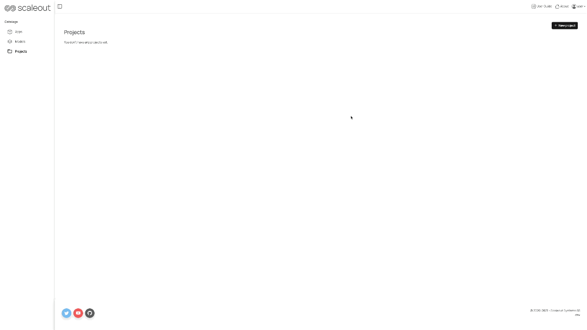
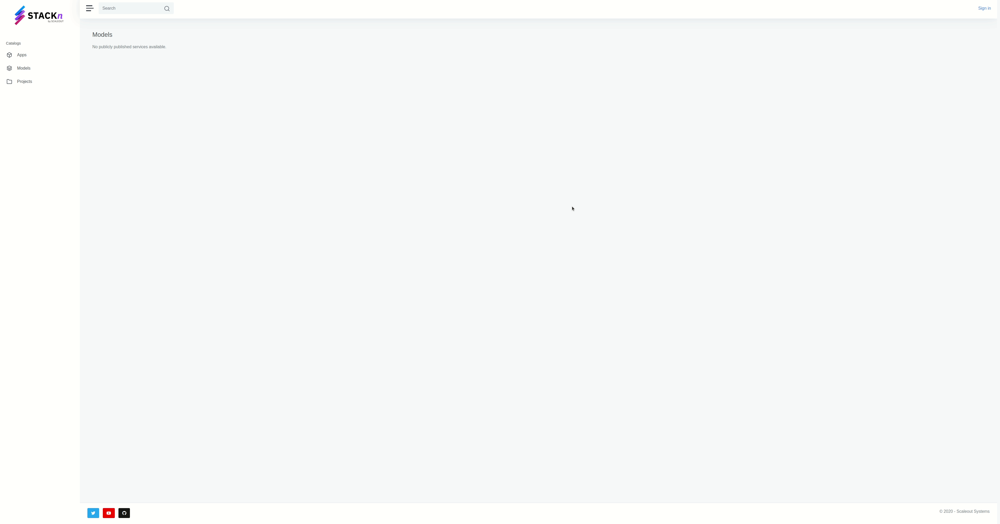
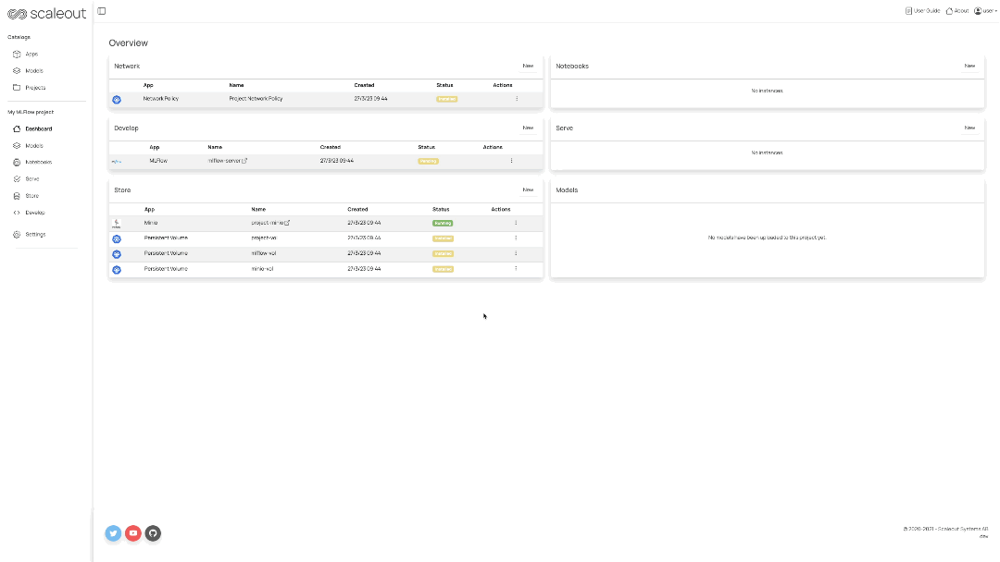
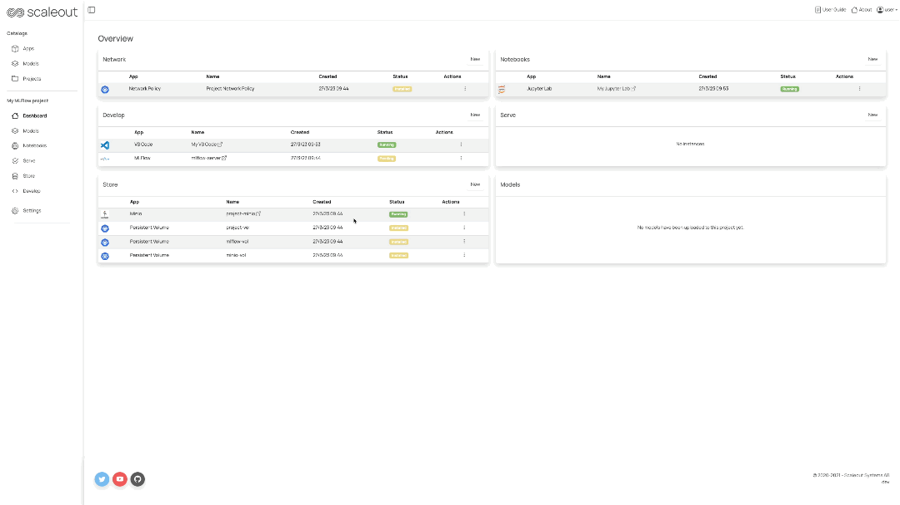

# Getting started

## Create a Project
To get up and running with STACKn, start by creating a new Project template following the steps below:

1. Click on the blue `+ New project` button in the top right corner.
2. Select one of the available project templates by clicking on the `Create` button.
3. Enter the project name (which is mandatory). You can still change the project template at this stage from the dedicated dropdown menu. The project description is optional.
4. Finally, click on the blue `Create project` button.



## Project Overview
Once you have created a project, you can find it under the general tab called _Projects_. Here you will find the list of all your created projects. To get an overview of one of your project, click on the `Open` button.

You will land on the project dashboard page, also called as the `Overview`. On the left side menu you can navigate through the various components/resources categories available within a STACKn project:
- **_Objects_:** a list of model objects created under the current project
- **_Compute_:** a series of components to be used for experimentation and training models with pre-configured data science environments.
- **_Serve_:** the most common ML serving applications used for deploying your trained models
- **_Store_:** project storage volumes, kubernetes persistent volume, object stores and databases for storing and sharing datasets.
- **_Develop_:** standard developing IDE such as VisualStudio together with dedicate tools for the machine learning lifecycle .
- [**_FEDn_:**](https://scaleoutsystems.github.io/fedn/) an open-source, modular and model agnostic framework for Federated Machine Learning. Scale seamlessly from pseudo-distributed development to real-world production networks in distributed, heterogeneous environments.
- **_Settings_:** the tab where a user can access the current project settings



## Create new resources directly from the Overview page
It is possible to create components directly from the dashboard of a project. Under each section within the overview you can find several `New` buttons.
Click on any of them to open the related dropdown menu and select which resource you would like to create:



## Create new resources from each specific tab category
Alternatively you can create components by first selecting one of the components categories from the left side panel of a project, under the dashboard tab. Under each tab you can find several "Cards" associated to resources that can be created by clicking on the `Create` button:




## Settings
The `Settings` page contains all the information about your Project and its components. Some
of the things you can do there are:

- Change your Project's description
- Find link to your MinIO instance and login keys
- Download a configuration file for your Project which is required when working with 
STACKn CLI
- Transfer ownership of your Project to another user
- Delete permanently your Project

# STACKn ML Tutorials

This tutorial is intended as quick tests/examples to get started using STACKn / Studio. It assumes access to an already deployed STACKn instance. 

General preparation: Download the Jupyter Notebooks from this repository, or be prepared to Git clone the repo or files as needed.

# MNIST

Purpose is to build and deploy a simple neural network.

Steps:

1. Create a "STACKn Default" project (wait a bit and refresh the page until all apps are created and available)
2. Start a new lab session (_Compute -> New -> Lab_) on the main Overview page. Name can be anything, select "project-vol" as Persistent Volume and leave the rest as defaults. 
3. Upload the _mnist_example_tf_serving.ipynb notebook_ to your project folder in labs (project-vol). Alternatively `wget https://raw.githubusercontent.com/scaleoutsystems/examples/main/tutorials/studio/quickstart/mnist_example_tf_serving.ipynb` in the Jupyter terminal.
4. Run the notebook up to (and including) the cell where the model is saved (`tf.saved_model.save...`).
5. In the Jupyter terminal (from your project folder, 'models' should be a subdirectory)

    5.1 `stackn create object mnist -r minor`

    5.2 `stackn get objects` (check that the model is listed)

**Note**: add the flag `--insecure` in case you have deployed STACKn locally with a self-signed certificate

6. Go back to the STACKn interface, go to Serve and deploy the model as a Tensorflow model:
    
    6.1 Click _Create_ in _Tensorflow Serving_
    
    6.2 Choose a name, set _Model_ to the model you just created and leave the rest as defaults
    
    6.3 A Tensorflow Serving service will pop up in the top of the window. Check logs to verify that it has deployed, (look for 'Entering the event loop ...') by clicking the folder icon.

7. Get the endpoint (right click the _Open_ link), paste it into the Jupyter notebook and call the endpoint to verify that it works.

# PyTorch

1. You can either clone this repo or just download locally the file called `vgg11_scripted.mar`

2. Create a "STACKn Default" project (wait a bit and refresh the page until all apps are created and available).

3. In your STACKn default project, open your Minio instance (by clicking on the Minio name link).

4. Once you are redirected to the Minio UI, perform the log in by entering the access key and secrets
    
    4.1 **tips**: they are available under the settings tab of the Minio app).

5. Create a bucket, say "pytorch", and Upload the `vgg11_scripted.mar` model archive.

6. Deploy the model with the _PyTorch Serve_ app (under the _Serve_ tab); the endpoint permissions should be "_public_" and the volume should be your Minio volume. Path to model store is your bucket name (e.g. "pytorch"). List of models can be left empty (then, by default, all models in the directory will be deployed). Few steps later you will use your PyTorch endpoit URL for running predictions.

7. Create a new _volume_ for a Dash app, say "dash-vol".

8. Go to the _Develop_ tab and launch a VSCode instance where you mount your newly created volume (e.g. "dash-vol") as a persisten volume for VSCode.

9. In your VSCode instance clone this repository and open the sub-folder _dash-test_.
    
    9.1 **tips**: it should be possible to clone this sub-folder only with git.

10. Go under the _Serve_ tab and copy your PyTorch endpouint URL.
    
    10.1 **tips**: right-click on the "_open_" link and copy the URL

11. In VSCode, go to the _dash-test_ folder and update line of 97 the `app.py` file with your PyTorch endpoint URL.

**Note**: since the model name is "vgg11_scripted", so the URL should be for example: ```https://torch-serve.studio.local.stackn.dev/predictions/vgg11_scripted```

12. Deploy the dash app with the related _Dash Deployment_ component (under _Serve_ tab): _Permissions_ can be either "public" or "project"; mount the created volume (e.g."dash-vol"); _Path to folder_ should be relative to your volume and it should be the "dash-test" sub-folder clone or downloaded in the previous step; finally and importantly, let _Debug deployment_ be "False".

13. Open the Dash App UI (by clickin on the "_open_" link)

14. Test the app! You can use "ball.jpeg" which you can find in this repository or any other image.

15. Last but not least, have fun!

# Transformers example project

1. Create a "STACKn Default" project (wait a bit and refresh the page until all apps are created and available)

2. Start a new Jupyter Lab session (_Compute -> New -> Jupiter Lab_) on the Dashboard overview page. _Name_ can be anything, select "project-vol" as Persistent Volume and leave the rest as defaults.

3. Launch a new terminal from within your Jupyter instance and clone the following repository inside the "project-vol" folder:
    
    3.1 `cd project-vol`

    3.2 `git clone https://github.com/scaleoutsystems/transformers-example-project` 

4. Install the pip requirements and enable the Jupyter notebook extension:
    
    4.1 `pip install -r requirements.txt`

    4.2 `jupyter nbextension enable --py widgetsnbextension` 

5. Now you should be ready to open the `getting_started_with_swebert.ipynb` in the _notebooks_ folder. Please follow the notebook's instructions.

6. Once you have run all the cells in the above notebook, open up again the terminal and execute the following command within the repository directory:
    
    6.1 `stackn create object afbert -r minor`

    6.2 `stackn get objects`

**Note:** add the flag `--insecure` in case you have deployed STACKn locally with a self-signed certificate

(Check that the model is listed; you should be able to see the newly created model object in your Studio UI, under the "_Objects_" tab)

7. Deploy the newly created model object with the "_Python Model Deployment_" component (under the "_Serve_" tab in Studio). _Name_ can be anything, _Model_ should match the name of the newly created model (e.g. "afbert:v0.1.0"); leave the rest as defaults.

    **Note:** It could take some time for this model to initialize, so keep checking the logs until it is available and wait until it is running successfully.

8. Once the above serving app is up and running, copy the endpoint URL by right-clicking on the _Open_ link.

9. Go back to your Jupyter Lab and open the `predict.ipynb` notebook under the _notebooks_ folder. Paste the copied URL at line 12 in order to use the correct endpoint for the prediction.

10. It is time to test the prediction! Run all the cells and check the results.

11. You can play around by changing the values of the `example` and `msk_ind` variables. The latter will mask (or "hide") one of the words in the example sentence; then the prediction will shown the possible candidates for such "missing" word.

# FEDn MNIST-Keras

>Preparations: It helps to have available a local copy of this repository. In alternative you can download or clone it within your FEDn environment, e.g. within your Jupyter Lab session.

### Setting a reducer and combiner in STACKn
1. Create a new project using the FEDn Project template.

2. Wait for all resources to start: you should see a "_FEDn Combiner_" and a "_FEDn Reducer_" under the "_FEDn_" tab.

3. Start a new Jupyter Lab instance under the "_Compute_" tab and make sure to select "_minio-vol_" as Persistent Volume. 

4. To train a model in FEDn you provide the client code as a tarball. For convenience, we ship a pre-made compute package (the 'client' folder in the [FEDn repository](https://github.com/scaleoutsystems/examples/tree/main/mnist-keras/package)) that defines what happens on the client side during training and validation, as well as some settings.
    
    4.1 Under the FEDn tab in Studio, click and open the link to the FEDn Reducer in a new tab

    4.2 Click the '/here' link for uploading a compute package. Then click on the "_browse_" button and upload `package.tar.gz` from [this repository](https://github.com/scaleoutsystems/examples/tree/main/mnist-keras/package); make sure to have copied such file locally before hand.

5. The baseline model (a CNN) is specified in the file 'client/init_model.py'. This script creates an untrained neural network and serializes that to a file, which is uploaded as the seed model for federated training. For convenience we ship a pregenerated seed model in the 'seed/' directory. If you wish to alter the base model, edit 'init_model.py' and regenerate the seed file. For uploading the initial model:

    5.1 Click on the browse button and upload the `initial_model.npz` file from the [same repository as above]((https://github.com/scaleoutsystems/examples/tree/main/mnist-keras/package))

6. At this point you should have been redirected to the main Reducer UI. Go to '_Network_' in the left menu and check that there is a combiner listed under '_Combiners_', with a number of 0 'Active clients' for the time being.

### Setting up a local client
We will now set up a separated client that will attach to the combiner. This should be done on a Linux/Unix machine with Docker.

1. Clone the mnist-keras repo either locally or within your Jupiter Lab instance (by opening up a terminal session)
```bash
git clone https://github.com/scaleoutsystems/examples
cd mnist-keras
```
2. Edit the `client.yaml` file in order to change as follows:

    2.1 set "_network_id_" to to the URL of the FEDn Reducer within your newly created project followed by `-network`, for example `reducer.studio.scaleoutsystems.com-network`

    2.2 set "_discover_host:_" to only the URL of the FEDn Reducer, for example `reducer.studio.scaleoutsystems.com`

    2.3 Finally, set "_discover_port_" to 443

**Note**: copy the URL from the browser and omit the scheme and trailing slash. For instance from a URL string such as `https://reducer.studio.scaleoutsystems.com/` copy only `reducer.studio.scaleoutsystems.com`

Alternatively you can download an already configured `client.yaml` file from the Reducer UI "_Network_" tab. On the right of the network diagram you should see a blue download button that says "_Download client config_". Download such file and replace the one already available in the cloned repository.

3. Rebuild the client docker image. You will find a Dockerfile within the root directory of the mnist-keras example to be used.
```bash
docker build -t client-local:latest .
```

4. Run the Docker image
```bash
docker run -v $PWD/data:/app/data -v $PWD/client.yaml:/app/client.yaml -it client-local:latest fedn run client -in client.yaml
```

### Run federated training 
Now it's time to run a few federated training rounds. Go to the Reducer web UI and:

1. Go to "_Control_" tab in the left menu.

2. In the "_Number of rounds_" field choose a value by either clicking on the - or + buttons (typing works fine too) and then click on the blue "_Start run_" button.

3. You should be redirected automatically to the "_Events_" tab, which can also be found in the left menu. Here you can follow how the training process is going.

**Note:** in terminal where you started and attached a FEDn client to the Reducer you should also see some actions!

4. In the 'Dashboard' tab (also in the left menu) you can see stats about the training rounds as they complete. Refresh the page to update with results from more training rounds.

5. Once the training and validation processes are completed, in the left menu under the "_Models_" tab you could find the output models

This completes the setup and training of a federated model, well done!

### Publish and serve the model as an API
To make the model useful it will be saved as a Tensorflow model and deployed in a serving container, as a publicly available web service.

1. Go back to your Studio overview page by clicking on the "_Dahsboard_" tab.

2. Open the Jupyter Lab instance that you have created at the beginning of this tutorial. Otherwise create a new one and make sure to select "_minio-vol_" as Persistent Volume.

3. Open a terminal session and clone this repository locally within your `minio-vol` folder:
```bash
cd minio-vol
git clone https://github.com/scaleoutsystems/examples
```

4. Save the model as a Tensorflow model. 
    
    4.1 Copy the notebook `deploy-fedn-mnist.ipynb` from the [Studio tutorial folder](https://github.com/scaleoutsystems/examples/tree/main/tutorials/studio/quickstart) to the [mnist-keras folder](https://github.com/scaleoutsystems/examples/tree/main/mnist-keras).
    ```bash
    cp tutorials/studio/quickstart/deploy_fedn_mnist.ipynb ./mnist-keras/
    cd ./mnist-keras/
    ```
    4.2 Open it and replace the model name with the most recent model name from 'minio-vol/fedn-models'

**Note:** You can find the most recent model name in a couple different ways:
- In the Minio UI, under the _fedn-models_ bucket
- In the FEDn Reducer UI, under the _Models_ tab
- In Jupyter Lab, since we are attaching the exact same Persisten Volume. Models name and details will be available under the `minio-vol/fed-models` path
    
    4.3 Run all cells to save the model.
    
    4.4 A new object is created in STACKn via the Python API: ```stackn.create_object('fedn-mnist', release_type="minor")```

    4.5 You should find the new created model object in the Studio UI under the Objects, by the name `fedn-mnist`

5. The model was created as a Tensorflow model, so it can now be deployed using the Tensorflow serving app.

    5.1 Go to Studio UI and create a TensorFlow Serving app, under the "_Serve_" tab

    5.2 _Name_ can be anything, most important is to select the newly created model (i.e. `fedn-mnist`) you have just created via the Jupyter notebook in the previous steps

    5.3 Leave all other settings as their defaults and click "_Create_"

6. Wait for the containerized app to be deployed. You can check the log (via the folder icon) for 'Entering the event loop'.

7. When installed, copy the link to the endpoint by right-clicking the "_Open_" link. 

8. Test the serving within your Jupyter Lab instance. Open the terminal and:

    8.1 Copy the notebook `mnist-predict.ipynb` from the [Studio tutorial folder](https://github.com/scaleoutsystems/examples/tree/main/tutorials/studio/quickstart) to the [mnist-keras folder](https://github.com/scaleoutsystems/examples/tree/main/mnist-keras).
    ```bash
    cp tutorials/studio/quickstart/mnist-predict.ipynb ./mnist-keras/
    cd ./mnist-keras/
    ```
    8.2 Paste the endpoint URL of the newly created TensorFlow serving instance inside the `mnist-predict.ipynb` notebook. That is, replace the URL within the `requests.post` method

    8.3 Run all cells to make a public (over the internet call) to the model and get a prediction from your federated model

This complete the creation and serving of a TensorFlow model from a federated learning training scenario with Studio and FEDn. Well done!
