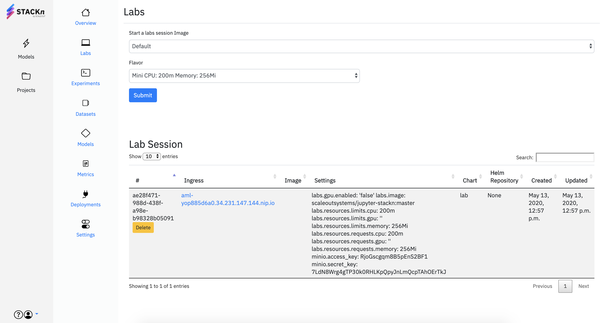
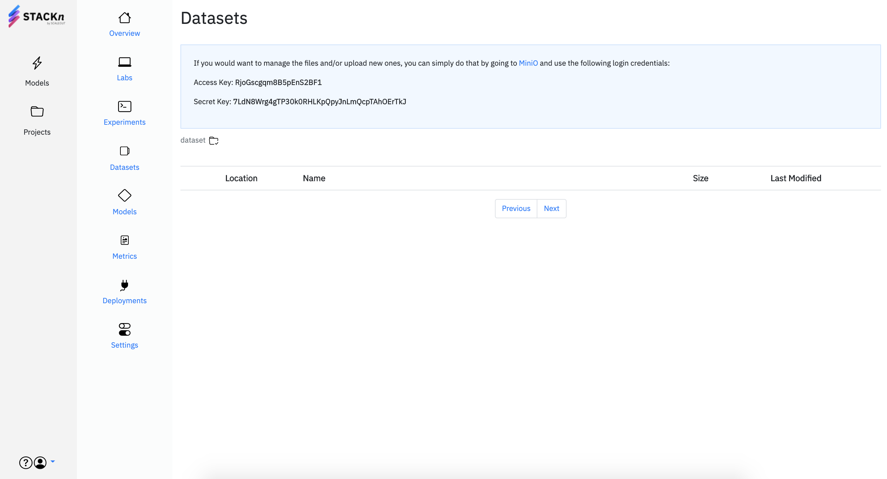
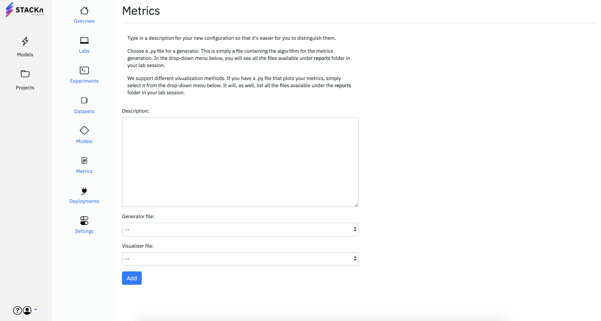

# Getting started

## Create a Project
To get up and running with STACKn, start by creating a new Project 
following the steps below:

1. Click `Projects` in the left side menu.
2. Type in a name and description for your Project.
3. If you have an existing GitHub repository that you want to use as a base
for your Project, include a URL to it in the `Import from...` field. This will import the repository in your Project file area.

## Project Overview
Once you have created a Project, you will see another side menu that gives you
access to the different components of STACKn. On the `Overview` page, you will see
a README.md file that serves as an introduction to the project. It's content is taken from a README file in the root of your working directory. If no such file is present, you will see a __Getting Started__ 
guide similar to this one.

## Create a new Lab Session
Lab Sessions let you spawn Jupyter Labs instances backed by resources of a given flavor. Labs are the hub for experimentation in your Projects. To set one up, follow the steps below:

1. Go to `Labs` from the side menu to the left.
2. Choose an `Image` and a `Flavor` for you Lab Session.
3. Simply press `Submit`. 

You will see a list of your Lab Sessions below the submit form.



## Datasets
When you create a Project, you automatically get an S3-compatible object storage (MinIO) for your datasets, 
reports, models etc. You can see what is available in your `datasets` bucket 
directly from STACKn on the `Datasets` page.

On top of the page, you find a link to your MinIO instance together with the login
credentials. Once you are logged in, you can upload files and manage your buckets, but 
do not delete or rename the already existing buckets since they fill specific functions.



## Models
You can see a list of your machine learning models on the `Models` page. From there, 
you can also deploy models or delete the ones that are not needed anymore.

## Metrics
Within the `Metrics` page, you can see a list of all your configurations for measuring
a model's performance. For example, classification reports.

To add new Metrics, click `Add new` in the top right corner of the screen.



To be able to configure this, you need to have a file implementing the algorithm for 
measuring the performance of the model. We call this a `generator file`. You might want 
to set up a way to visualize this performance. For example, a pyplot for a classification
report. We call this a `visualizer file`. These two files and any other metrics-related files
need to be placed under a folder called `reports` in your Lab Session. In this way, you will
get access to all the related files within your working directory when executing the generation
and visualization algorithms. Once the files are stored in the correct place, you will see 
them in the drop-down menus in the submit form.

## Settings
The `Settings` page contains all the information about your Project and its components. Some
of the things you can do there are:

- Change your Project's description
- Find link to your MinIO instance and login keys
- Download a configuration file for your Project which is required when working with 
STACKn CLI
- Transfer ownership of your Project to another user
- Delete permanently your Project

## Next steps
Now that you are familiar with the base functionality of STACKn, a good next step is to work through the example Projects available here: 

* [Classification of hand-written digits (MNIST)](https://github.com/scaleoutsystems/digits-example-project)
* [Classfication of malignant blood cells (AML)](https://github.com/scaleoutsystems/aml-example-project)

These examples will teach you how to build a ML-model from scratch and how to serve it for private or public use. 

# Deploy a Model

Create a directory and initialize an empty project structure:

```
mkdir MNIST && cd MNIST
stackn init
```

## Data

We keep the raw data in ``data/raw``:

```
wget http://yann.lecun.com/exdb/mnist/train-images-idx3-ubyte.gz -P data/raw/
wget http://yann.lecun.com/exdb/mnist/train-labels-idx1-ubyte.gz -P data/raw/
wget http://yann.lecun.com/exdb/mnist/t10k-images-idx3-ubyte.gz -P data/raw/
wget http://yann.lecun.com/exdb/mnist/t10k-labels-idx1-ubyte.gz -P data/raw/
```

Unzip the raw data:

```
gunzip data/raw/t*-ubyte.gz
```

The data is not in any standard image format, so we will need to process it before using it for training a model. The processed data goes in ``data/processed``. For this we will use the packages ``idx2numpy``, ``numpy``. Add them to ``requirements.txt``.

We will now create a script for preprocessing the data, ``src/data/load_convert.py``:

```
import idx2numpy
import numpy as np
import pickle

# Convert the data to numpy arrays
imgs_train = idx2numpy.convert_from_file('data/raw/train-images-idx3-ubyte')
imgs_test = idx2numpy.convert_from_file('data/raw/t10k-images-idx3-ubyte')
labels_train = idx2numpy.convert_from_file('data/raw/train-labels-idx1-ubyte')
labels_test = idx2numpy.convert_from_file('data/raw/t10k-labels-idx1-ubyte')

# Pickle the data
file_train = open('data/interim/mnist_train.pkl', 'wb')
file_test = open('data/interim/mnist_test.pkl', 'wb')
pickle.dump((imgs_train, labels_train), file_train)
pickle.dump((imgs_test, labels_test), file_test)
file_train.close()
file_test.close()
```

```
python src/data/load_convert.py
```

Next, we create a script ``src/data/reshape_normalize.py`` that takes the interim data and reshapes and normalizes it to its final format, stored in ``data/processed``:

```
import pickle

file_train = open('data/interim/mnist_train.pkl', 'rb')
file_test = open('data/interim/mnist_test.pkl', 'rb')
(imgs_train, labels_train) = pickle.load(file_train)
(imgs_test, labels_test) = pickle.load(file_test)

# Reshape the arrays to work with Keras
imgs_train = imgs_train.reshape(imgs_train.shape[0], 28, 28, 1)
imgs_test = imgs_test.reshape(imgs_test.shape[0], 28, 28, 1)

# Convert to floats before normalizing
imgs_train = imgs_train.astype('float32')
imgs_test = imgs_test.astype('float32')

# Normalize RGB to floats between 0.0 and 1.0
imgs_train /= 255
imgs_test /= 255

# Save the processed data
file_train = open('data/processed/mnist_train.pkl', 'wb')
file_test = open('data/processed/mnist_test.pkl', 'wb')
pickle.dump((imgs_train, labels_train), file_train)
pickle.dump((imgs_test, labels_test), file_test)
```

```
python src/data/reshape_normalize.py
```

## Train

Now that we have the processed data, we can build and train a model. We will use ``Keras`` to build the model, which requires Tensorflow, so add ``keras`` and ``tensorflow`` to ``requirements.txt``.

The script that trains the model is saved in ``src/models/train.py``. The trained model is saved in ``models/``

```
import keras
from keras.layers import Conv2D, MaxPooling2D
from keras.layers import Dense, Dropout, Flatten
from keras.models import Sequential
import pickle

# Create an initial CNN Model
input_shape = (28, 28, 1)
num_classes = 10

model = Sequential()
model.add(Conv2D(32, kernel_size=(3, 3),
                activation='relu',
                input_shape=input_shape))

model.add(Conv2D(64, (3, 3), activation='relu'))
model.add(MaxPooling2D(pool_size=(2, 2)))
model.add(Dropout(0.25))
model.add(Flatten())
model.add(Dense(128, activation='relu'))
model.add(Dropout(0.5))
model.add(Dense(num_classes, activation='softmax'))

model.compile(loss=keras.losses.categorical_crossentropy,
              optimizer=keras.optimizers.Adadelta(),
              metrics=['accuracy'])
model.summary()


# Load the processed training data.
file_train = open('data/processed/mnist_train.pkl', 'rb')
(imgs_train, labels_train) = pickle.load(file_train)


batch_size = 32
epochs = 1

# Train
labels_train = keras.utils.to_categorical(labels_train, num_classes)
model.fit(imgs_train, labels_train, batch_size=batch_size, epochs=epochs, verbose=1)

# Save the trained model
model_json = model.to_json()
f = open('models/model.json', 'w')
f.write(model_json)
f.close()
model.save_weights('models/model_weights.h5')
```

```
python src/models/train.py
```

## Deploy

To use the trained model, we need to implement ``model_load`` and ``model_predict`` in ``src/models/predict.py``:

```
import tensorflow as tf
import numpy as np
import json

def model_load():
    # Should load and return the model.
    # Optional, but if present will be loaded during
    # startup in the "default-python" environment.
    file_json = open('models/model.json', 'r')
    model = tf.keras.models.model_from_json(file_json.read())
    model.load_weights('models/model_weights.h5')
    return model

def model_predict(inp, model=[]):
    # Called by default-python environment.
    # inp -- default is a string, but you can also specify
    # the type in "input_type.py".
    # model is optional and the return value of load_model.
    # Should return JSON.
    pred = model.predict(np.array(inp.img))
    return json.dumps({"prediction": pred.tolist()})
```

Note that we access the input as ``inp.img``. The input is defined in ``src/models/input_type.py``:

```
from pydantic import BaseModel
from typing import List

class PredType(BaseModel):
    # Optional, but if presents specifies the input 'inp'
    # to predict.
    # Default pred: str. Can be accessed in predict as inp.pred.
    img: List[List[List[List[float]]]]
```

Here, the input is a four-dimensional list of floats. You can read more about Pydantic here: https://pydantic-docs.helpmanual.io/

You create a new model with the CLI:

```
stackn create model  -n mnist -r minor
```

and then you deploy it in the ``default-python`` environment:

```
stackn create deployment -m mnist -d default-python
```

List your new deployment:

```
stackn get deployments
```

## Predict

You can call the endpoint:

```
import pickle

# Get an image for input to the deployment
file_test = open('data/processed/mnist_test.pkl', 'rb')
(imgs_train, labels_train) = pickle.load(file_test)
img_inp = imgs_train[0:1].tolist()

# Get a token for authorization
from scaleout.auth import get_token
token, config = get_token(secure=False)

import requests
url = 'your endpoint'
res = requests.post(url, headers={"Authorization": "Token "+token}, json={"img": img_inp}, verify=False)
print(res.json())
```

You can also test your ``predict`` function locally (add to ``src/models/predict.py``)

```
if __name__ == "__main__":
    model = model_load()
    model.summary()

    import pickle
    file_test = open('data/processed/mnist_test.pkl', 'rb')
    (imgs_train, labels_train) = pickle.load(file_test)
    img_inp = imgs_train[0:1].tolist()

    from input_type import PredType
    inp = PredType(img=img_inp)
    res = model_predict(inp, model)
    print(res)
```

# CLI

## Minimal Model Deployment

If you haven't already installed the STACKn CLI, you can install it with pip:

```
pip install git+https://@github.com/scaleoutsystems/stackn@develop#subdirectory=cli
```

- Create a project

```
stackn create project -n demo
```

- Create a directory for your model

```
mkdir demo-model
cd demo-model
```

- Initialize the model with

```
stackn init
```

- Create the model and deploy it

```
stackn create model -n test-model -r minor
stackn create deployment -m test-model -d default-python
```

It will take a minute for the model to deploy. 

- Once it is ready, you can run a prediction

```
stackn predict -m test-model -v v0.1.0 -i '{"pred":"test"}'
```

- Alternatively you can create a lab session

```
stackn create lab -f large -e default
```

and then you can call the model endpoint from inside a notebook

```
from scaleout.auth import get_token
import requests
url = 'https://studio.scilifelab.stackn.dev/demo-cbn/serve/demo-model/v010/predict/'
token, config = get_token()
res = requests.post(url, headers={"Authorization": "Token "+token}, json={"pred":"test"})
res.json()
```
