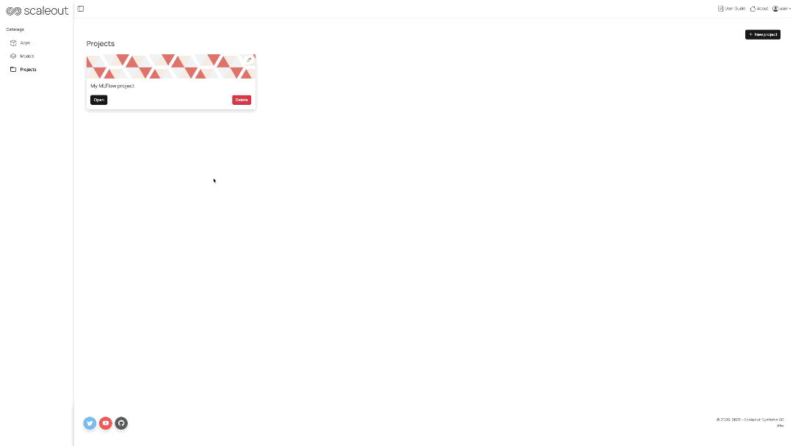

# Getting started

## Create a Project
To get up and running with STACKn, start by creating a new Project template following the steps below:

1. Click on the blue `+ New project` button in the top right corner.
2. Select one of the available project templates by clicking on the `Create` button.
3. Enter the project name (which is mandatory). You can still change the project template at this stage from the dedicated dropdown menu. The project description is optional.
4. Finally, click on the blue `Create project` button.

## Project Overview
Once you have created a project, you can find it under the general tab called _Projects_. Here you will find the list of all your created projects. To get an overview of one of your project, click on the `Open` button.

You will land on the project dashboard page, also called as the `Overview`. On the left side menu you can navigate through the various components/resources categories available within a STACKn project:
- **_Objects_:** a list of model objects created under the current project
- **_Compute_:** a series of components to be used for experimentation and training models with pre-configured data science environments.
- **_Serve_:** the most common ML serving applications used for deploying your trained models
- **_Store_:** project storage volumes, kubernetes persistent volume, object stores and databases for storing and sharing datasets.
- **_Develop_:** standard developing IDE such as VisualStudio together with dedicate tools for the machine learning lifecycle .
- [**_FEDn_:**](https://scaleoutsystems.github.io/fedn/) an open-source, modular and model agnostic framework for Federated Machine Learning. Scale seamlessly from pseudo-distributed development to real-world production networks in distributed, heterogeneous environments.
- **_Settings_:** the tab where a user can access the current project settings

## Create new resources directly from the Overview page
It is possible to create components directly from the dashboard of a project. Under each section within the overview you can find several `New` buttons.
Click on any of them to open the related dropdown menu and select which resource you would like to create:

## Create new resources from each specific tab category
Alternatively you can create components by first selecting one of the components categories from the left side panel of a project, under the dashboard tab. Under each tab you can find several "Cards" associated to resources that can be created by clicking on the `Create` button:

## Settings
The `Settings` page contains all the information about your Project and its components. Some
of the things you can do there are:

- Change your Project's description
- Find link to your MinIO instance and login keys
- Download a configuration file for your Project which is required when working with 
STACKn CLI
- Transfer ownership of your Project to another user
- Delete permanently your Project

# STACKn ML Tutorials

In /examples you will find two examples using MLFlow and Tensorflow, including model creation and serving. We suggest to compress this folder into a .tar file and then upload the file in a Jupyter Lab instance and using the MLFlow project template. Follow the instructions in the README of each example to run the examples or follow the instructions below.

## MLFlow-diabetes-sklearn
This example of using MLFlow to track ML experiments is based on the [sklearn diabetes tutorial](https://github.com/mlflow/mlflow/tree/master/examples/sklearn_elasticnet_diabetes/linux). The example trains an ElesticNet model provided by Sklearn. MLFlow will track hyperparams and the model and add the model to the registry. STACKn model registry will sync with the MLFlow registry, thus creating a model object is not needed by the user. 

From inside a Jupyter lab instance:
### Instructions
- `$ mlflow run .`
- This will run the MLFlow project defined in MLproject.
- Navigate to STACKn UI models tab and make sure the a new model ElasticNet version 1 has been created, alt. in jupyter lab terminal run: `$ stackn get model-obj -t mlflow`
- From the UI click on the link for the MLFlow server. Observe the newly created ecperiment under the "Experiment" tab. Also observe the newly created model (version 1) under the "Models" tab.
- From the STACKn UI navigate to the "Serve" tab. Create a new MLFlow-Serve instance using the newly created model. Once the status has been updated to Running, click on the "Open" link and copy the URL (endpoint) from the browser URL field. If you get a "Bad gateway" error message the MLFlow-Serve service might not yet be ready. If so, try again later.

## Inference requests
- In ./tests/tests is an example of how to send inference request to the service. To run this tests you first need to create conda environment provided in the folder:
- `conda env create -f env_test.yaml`
- Once that is done: `./tests serve --endpoint https://<release>.domain/invocations`
- Where the endpoint is the URL you copied from the browser.
- Obs! If your domain is .127.0.0.1.nip.io the above request won't work, instead use `--endpoint http://<release>-mlflow-svc/invocations`

## MNIST-KERAS Tensorflow Serve Example

based on: https://github.com/scaleoutsystems/fedn/tree/master/examples/mnist-keras

From inside jupyter lab:

## Instructions
- `$ ./build.sh`
- The above script will create a neural network using Tensorflow, save the model and create a STACKn model object using the API. Navigate to the project dashboard and confirm the the model object has been created.
- Create a Tensorflow-serve instance from STACKn UI, copy the endpoint URL: From the project dashboard navigate to the Serve tab and create a Tensorflow-Serve instance using the newly created model object. When status has been updated to "Running", click on the "open" link and copy the URL(endpoint excluding :predict) from the browser URL field.
- From the jupyter lab instance: `$ ./entrypoint predict --endpoint https://\<release\>.domain/v1/models/models`
- Running the above script will send an inference request to the serve endpoint using some test data.
- Obs! If your domain is .127.0.0.1.nip.io the above request won't work, instead use `--endpoint http://<release>-tf-svc/v1/models/models`
